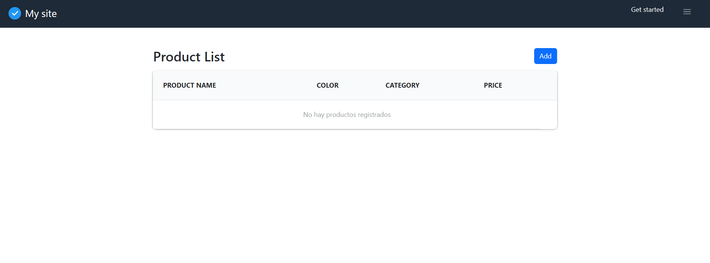
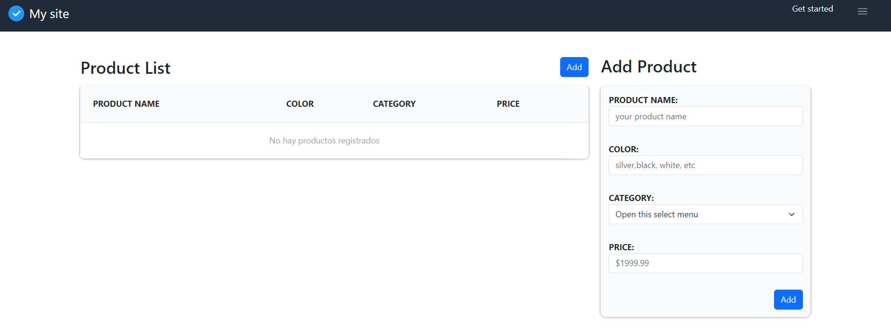
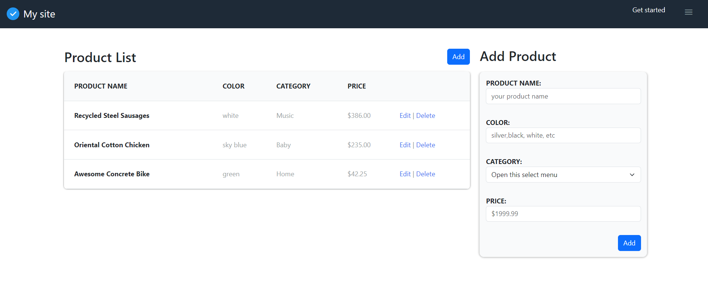
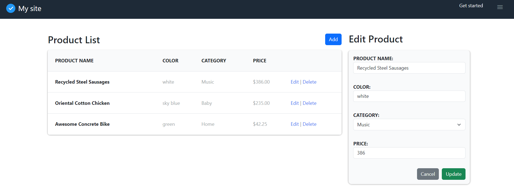
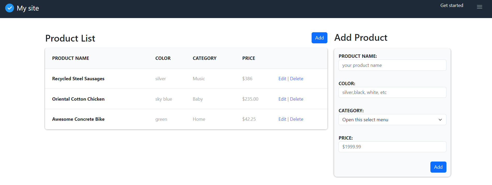
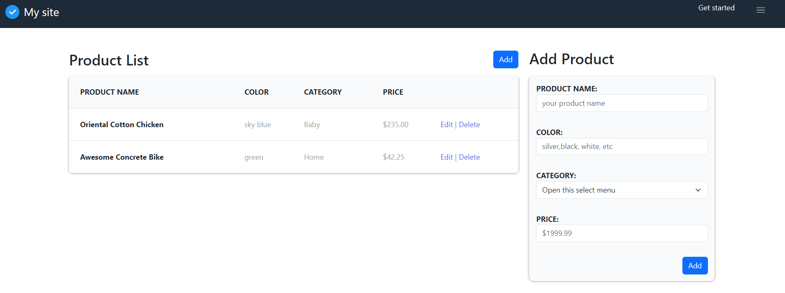
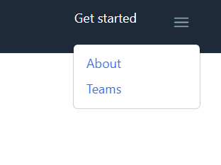
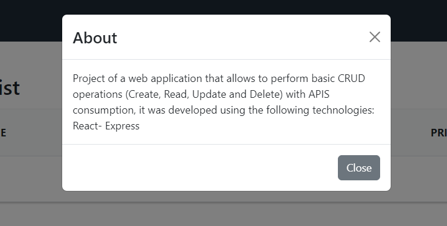
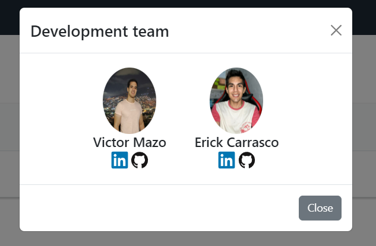

# Project in pairs - CRUD (React) 🚀  
## Table of contents :page_facing_up:
- [Overview](#overview)
  - [Installation](#Installation)  
  - [The challenge](#the-challenge)
  - [Screenshot](#screenshot)
- [My process](#my-process)
  - [Built with](#built-with)
  - [What I learned](#what-i-learned)
  - [Continued development](#continued-development)
  - [Useful resources](#useful-resources)
- [Authors](#authors)

## Overview :writing_hand:
The Product Manager is a web application developed with React and Sass that allows you to efficiently manage products. The application provides functionalities to add, edit, delete, and view products. It includes a form for adding and editing products, as well as a table that displays the registered products. The application connects to a backend API developed in Express to handle the data.
This repository contains the frontend structure, here is the link of the backend repository: [Backend-Repository](https://github.com/viamazoba/CrudProject-Express),and the link of the application deployed in vercel: [Deployed Project](https://crud-project-react-express.vercel.app/)

### Installation :gear:
To get started with the project, follow these steps:

1. Clone the repository:
```shell
git clone https://github.com/erickfabiandev/CrudProject-React-Express
  ```
2. Navigate to the project directory:
```shell
cd CrudProject-React-Express
 ```
3. Install the dependencies:
```shell
 npm install
  ```
4. Start the application: 
```shell
 npm run dev
  ```

### The Challenge :weight_lifting_man:
The main challenge of this project is to develop a web application that allows efficient management of products. The key functionalities include:

* Add products: Use the form to add new products to the database via the backend API.
* Edit products: Modify the information of existing products using the form and update the changes via the API.
* Delete products: Remove products from the database via the API with a single click.
* View products: The table displays the registered products obtained from the API in a clear and organized manner.

### Screenshot 📷 
Here is a screenshot of the project's interface:

**1. Web View**

**1.1. Features (ADD/EDIT/DELETE)**
* Add Button (Top): Activates the view to add a new product

* Add button (bottom): Add a product to the list of products, as long as the form is complete

* Edit button:* Captures the product data transporting it to the form for editing, in addition to activating the update and cancel buttons
* Update button: Updates the product data, modifying it in the database and refreshing the product list view. To finish, go back to the view to add a new product


* Delete button: Deletes a selected product from the database and refreshes the product list view.


**1.2. Additional Features**
Option About (Information about the project) / Option Teams (Development team)




**2. Mobile View**


## My Process :mountain:
### Built With :hammer_and_wrench:
The project was built using the following technologies:

* React: JavaScript library for building interactive user interfaces.
* Sass: CSS preprocessor for easy and organized styling.
* API: The application consumes a backend API developed in Express to manage product data.

### What I Learned :microscope:
During the development of this project, I gained experience in:

* Utilizing React to create reusable components and manage the application state.
* Applying custom styles using Sass to enhance the visual appearance.
* Consuming an Express backend API to perform CRUD (Create, Read, Update, Delete) operations on products.

### Continued Development :briefcase:
In the future, there are plans to improve the Product Manager with the following features:

* Implement user authentication to secure product management actions.
* Add filtering and search functionalities based on the API to facilitate product exploration.
* Enhance the user interface and user experience to make it more intuitive and appealing.

### Useful Resources :sos:
During the development of this project, the following resources were helpful:

* Official React documentation: https://reactjs.org/docs
* Official Sass documentation: https://sass-lang.com/documentation

## Authors :nerd_face:

This project was created by viamazoba and erickfabiandev. You can find our GitHub profiles at the following links:
- [viamazoba](https://github.com/viamazoba)
- [erickfabiandev](https://github.com/erickfabiandev)
